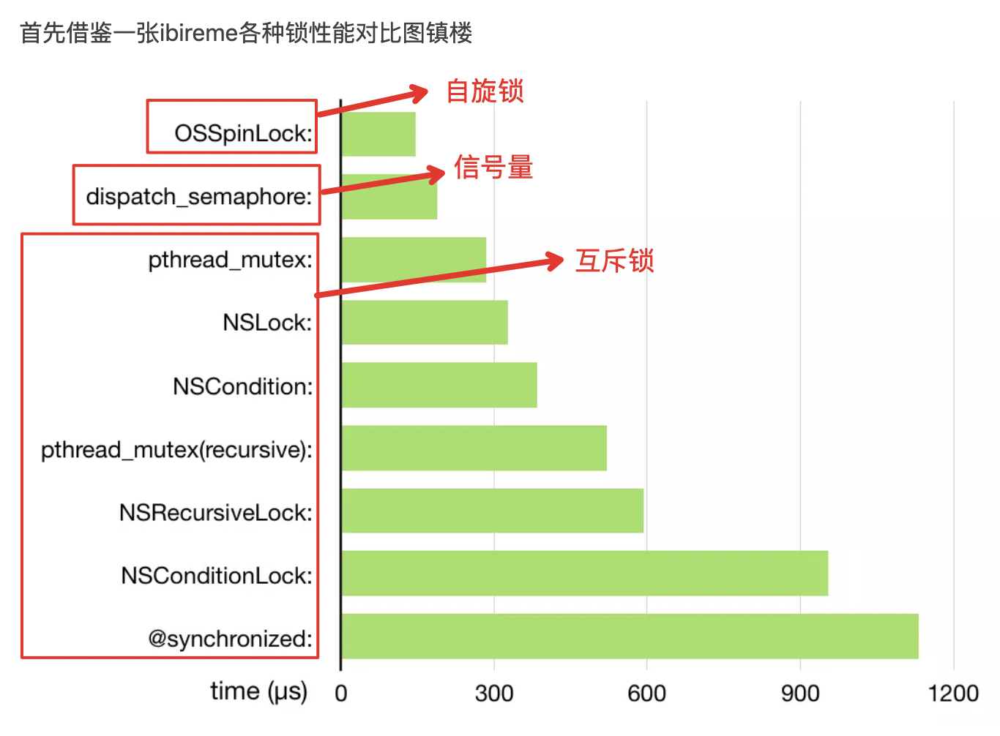

### 知识点 1、 Objective-C 的类可以采用多继承么？可以采用多个协议么？
+ 不可以多继承，容易出现菱形继承的问题，可以采用多个协议。
+ 多继承的缺点：一个子类继承的多个父类中拥有相同名称的实例变量，子类在引用该变量时将会产生歧义，无法判断使用哪个父类的变量。
+ 如果一个子类继承的多个父类中拥有相同的方法，子类没有覆盖该方法，那么调用该方法时将产生歧义，无法判断应该调用哪个父类的方法。

---

### 知识点 2、`#import、#include、#import<> @import @class`
+ `#include` 赋值粘贴
+ `#import “”` 本质与 `#include` 一样，只不过用 `#ifdef #define` 避免了重复引用的问题
+ `#import <>` 导入系统框架
+ `@import Modules` 模块导入，可以参考这个[链接](https://blog.csdn.net/huangfei711/article/details/76340383) 
这个[链接](https://blog.csdn.net/zcmuczx/article/details/78308631)讲@import更详细
+ `@class` 只需要知道引用类的名称即可，不需要知道内部的实现变量和方法。@class还可以解决循环依赖的问题，A.h导入了B.h，而B.h导入了A.h，每一个头文件的编译都要让对象先编译成功才行。

---

### 知识点 3、Category 
+ Category 是什么？
    - Category 类别，特性是不用定义子类就能扩展一个类的功能，还能将不同的功能分开，不会影响其他类和原有类的关系。
+ 类扩展（Extension）是什么？
    - 能为某个类添加成员变量,属性,方法，一般写到 .m 中。
+ 继承与 Category 的区别：
    - 继承是用来描述类与类之间的关系的。
+ 扩展一个类的方式用继承好还是 category 好？为什么？
    - 扩展一个类用 Category 相对好些，继承可能会破坏原有类的封装性。
+ Category 是否可以添加属性？如何通过 runtime 为 catrgory 添加属性？
    - 可以声明 @property 但是不会自动生成 setter/getter 方法，也不会生成以及实现成员变量。因为结构体中只有方法列表，没有属性列表，不可以直接添加属性，但是可以通过 runtime 进行属性的添加。
+ 如果分类中有和原类重名的方法，调用顺序如何？
    - 同名方法调用优先级：`分类>本类>父类`
    - 多个分类拥有重名方法，方法调用优先级：`后编译>先编译>本类>父类`
    
---

### 知识点 4、`@protected、@private、@public` 声明有什么含义？
+ `@protected` 受保护的，该类的实例变量只能在该类和其子类内部访问，其他类不能访问
+ `@private` 私有的，该实例变量只能在该类内访问，其他类不能访问
+ `@public` 共有的，该实例变量谁都可以访问

---

### 知识点 5、id 与 instancetype 区别
```objective-c
@implementation Teacher
//id 运行时检查，id 可作为方法参数
+ (id)teacher {
    return [[Student alloc]init];
}
//instancetype 编译时检查类型，instancetype 只作为返回值
+ (instancetype)teacher1 {
//这里会有警告,
//Incompatible pointer types returning 'Student *' from a function with result type 'Teacher *'
    return [[Student alloc]init];
}
@end
```

---

### 知识点 6、深拷贝 浅拷贝
+ [链接](https://www.jianshu.com/p/63239d4d65e0)


---

### 知识点 7、@property、@synthesize 作用？
+ [详细链接](https://www.jianshu.com/p/44d12884e24e)
+ 之前的对应关系：@property 声明方法.h文件中声明 getter 和 setter 方法，@synthesize 在.m文件中帮助实现 getter 和 setter 方法。Xcode4.5之后的版本中，可以省略@synthesize关键字，编译器会自动生成 get 和 set 方法的实现。
+ @property 声明读写方法，@ synthesize 自动生成合成存取方法。
+ 简单讲
```
@property = ivar + getter + setter
```


---

### 知识点 8、oc各种锁

+ [链接](https://www.jianshu.com/p/d69495dac8cb)详细描述了自旋锁和互斥锁，以及优缺点
+ pthread_mutex(recursive)、NSRecursiveLock、@synchronized都是递归锁。 [链接](https://www.jianshu.com/p/777c28eface5)


---

### 知识点 9、OC 消息转发机制

---

### 知识点 10、method swizzling

---

### 知识点 11、GCD

---


### 知识点 12、AutoLayout

---


