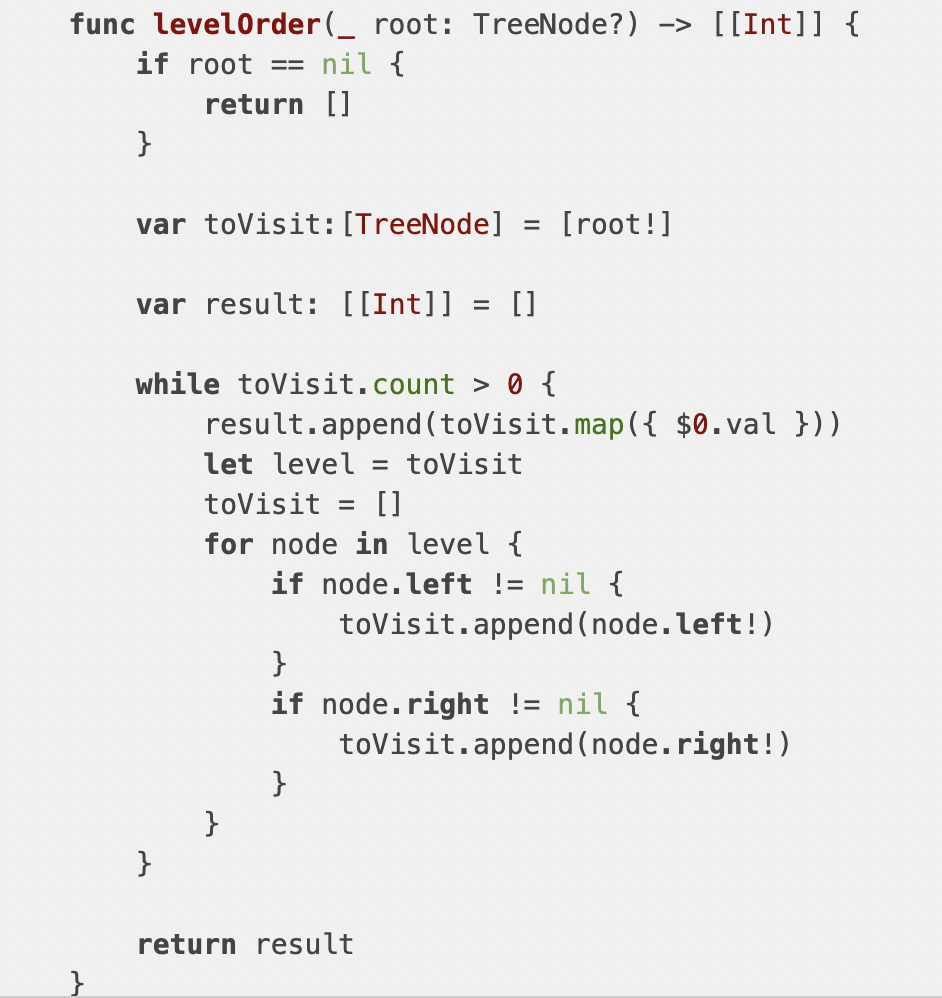

# 二叉树之遍历

## 数据结构定义
``` swift
class TreeNode {
    
    var value : Any
    
    var leftNode : TreeNode?
    
    var rightNode : TreeNode?
    
    init(nodeValue: Any) {
        value = nodeValue
    }
    
}
```
## 前序遍历
* 递归

``` swift
func preorder(root : TreeNode? , result: inout [Int]) {
    guard let rootNode = root else {
        return;
    }
    result.append(rootNode.value)
    preorder(root: rootNode.leftNode, result: &result)
    preorder(root: rootNode.rightNode, result: &result)
}

func preorderAlgrithm(root : TreeNode?) -> [Int] {
    var result = [Int]()
    preorder(root: root, result: &result)
    return result
}

```
* 非递归

``` swift
func preorderAlgrithm(root : TreeNode?) -> [Int] {
    var result = [Int]()
    var stack = [TreeNode]()
    var p = root
    while p != nil || stack.count > 0 {
        while let node = p {
            result.append(node.value)
            stack.append(node)
            p = node.leftNode
        }
        
        if stack.count > 0 {
            let node = stack.popLast()
            p = node?.rightNode
        }
    }
    return result
}
```
##中序遍历
* 递归

``` swift
func inorder(root : TreeNode?, result : inout [Int]) {
    guard let rootNode = root else {
        return;
    }
    inorder(root: rootNode.leftNode, result: &result)
    result.append(rootNode.value)
    inorder(root: rootNode.rightNode, result: &result)
}

func inorderAlgrithm(root : TreeNode?) -> [Int] {
    var result = [Int]()
    inorder(root: root, result: &result)
    return result
}
```
* 非递归

``` swift
func inorderAlgrithm(root : TreeNode?) -> [Int] {
    var result = [Int]()
    var stack = [TreeNode]()
    var p = root
    while p != nil || stack.count > 0 {
        while let node = p {
            stack.append(node)
            p = node.leftNode
        }
        
        if stack.count > 0 {
            let node = stack.popLast()!
            result.append(node.value)
            p = node.rightNode
        }
    }
    return result
}
```
##后序遍历
* 递归

``` swift
func postorder(root : TreeNode?, result : inout [Int]) {
    guard let rootNode = root else {
        return;
    }
    postorder(root: rootNode.leftNode, result: &result)
    postorder(root: rootNode.rightNode, result: &result)
    result.append(rootNode.value)
}

func postorderAlgrithm(root : TreeNode?) -> [Int] {
    var result = [Int]()
    postorder(root: root, result: &result)
    return result
}
```
* 非递归

> 个人感悟：后序遍历算是三种最难的，如果把栈的特性融入进去会变得跟前序遍历变得一样简单。栈特性是：后进先出；后序遍历的规则是：左右根；所以先把跟元素压入栈，然后压入右孩子，最后压入左孩子。栈构建完成后，我们遍历一遍栈，就会先读取左孩子，再读取右孩子，最后读取根节点。整个算法就是对前序遍历的微调，会前序就学会了后序。

``` swift
func postorderAlgrithm(root : TreeNode?) -> [Int] {
    var result = [Int]()
    var stack = [TreeNode]()
    var resultStack = [TreeNode]()//此处可以省略，这样写为了体现栈的特性
    var p = root
    
    while p != nil || stack.count > 0 {
        
        while let node = p {
            stack.append(node)
            resultStack.append(node)
            p = node.rightNode
        }
        
        if stack.count > 0 {
            let node = stack.popLast()!
            p = node.leftNode
        }
    }

    for node in resultStack.reversed() {
        result.append(node.value)
    }
    
    
    return result
}

```
## 层次遍历
> 二叉树的层次遍历考察的是队的应用。下面这个算法正是体现了这一点。如果站在swift语言（由于swift的数组是值类型，可以通过赋值的方式实现copy操作，并且系统对该操作帮你做很多优化。这样就不需要去区分队列中的元素属于哪一层的问题）使用角度来说，下面算法不是完美的。但站在算法思考角度，应该还是ok的，该算法的时间复杂度为O(n),控件复杂度O(n).如果换做每层元素都copy一份吧，时间复杂度不变，空间复杂度按理论应该变为O(2*n)，但是在swift也许还是O(n)

``` swift
func levelOrderAlgrithm(_ root: TreeNode?) -> [[Int]] {
        var result = [[Int]]()
        var level = [Int]()
        var queue = [TreeNode?]()
        
        guard let rootNode = root else {
            return result
        }
        //插入nil表示新的一层开始，oc可以插入nsull
        queue.append(nil)
        queue.append(rootNode)
        while queue.count > 1 {
            //新的一层进行初始化工作
            var firstVisitor = true
            level.removeAll()
            queue.remove(at: 0)
            while let node = queue[0] {
                queue.remove(at: 0)
                level.append(node.value)
                if firstVisitor {
                    queue.append(nil)
                    firstVisitor = false
                }
                if let leftNode = node.leftNode {
                    queue.append(leftNode)
                }
                if let rightNode = node.rightNode {
                    queue.append(rightNode)
                }
            }
            result.append(level)
        }
        return result
        
    }
```
附我不太喜欢的做法
