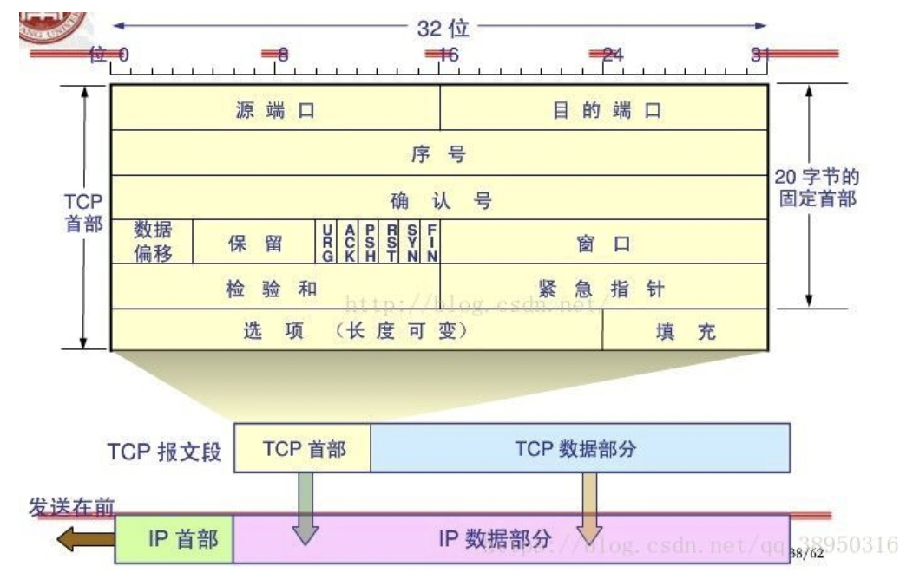
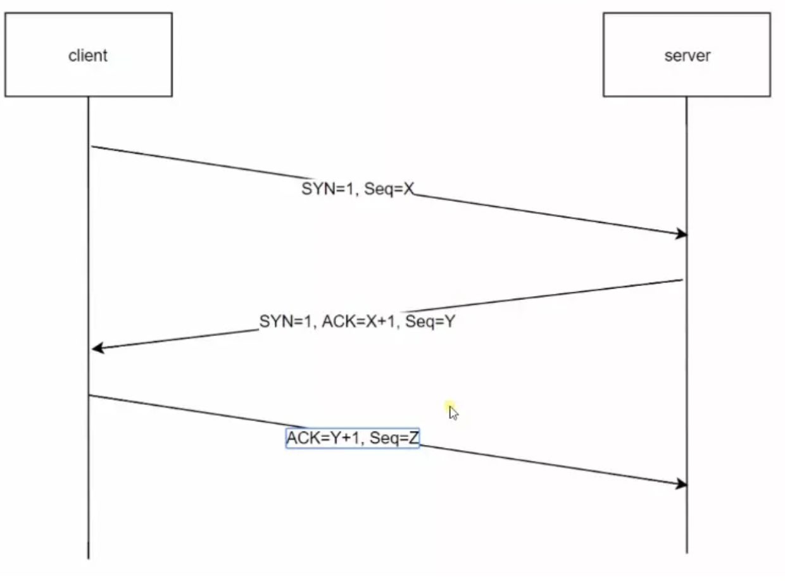
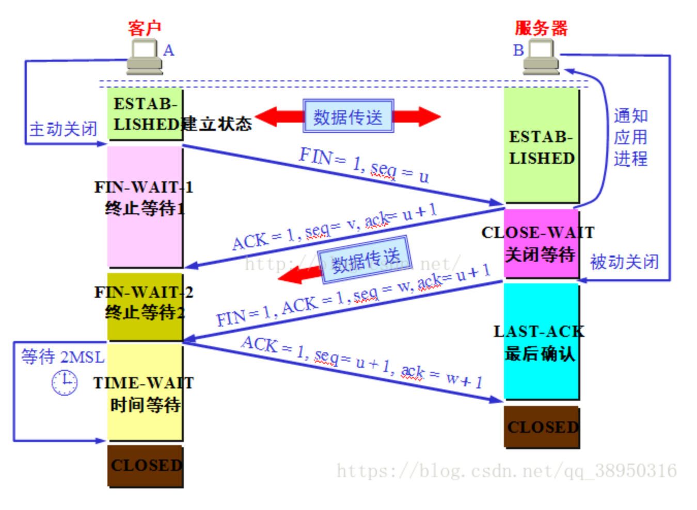

##### 三次握手+四次挥手
* TCP 报文段，注意“序号”=seq+“确认号”=ack+"ACK"+"SYN"+"FIN"对应建立链接过程中的逻辑

    1. seq:本地创建的一个随机数
    2. ack:是序号+1，即期望收到的下一个字节的编号
    3. 确认ACK:当ACK=1时，确认号才生效；ACK=0时，确认号无效
    4. 同步SYN:当SYN=1+ACK=0时 = 连接请求报文段；如果同意连接，则响应报文中需要SYN=1+ACK=1
    5. 终止FIN:FIN=1 = 报文段的发送方数据已经发送完毕
###### 三次握手
* 时序图

* 握手过程
        1. 第一次握手：客户端发送`SYN=1`+`seq=X`,(X=随机值)包到服务端，并进入`SYN_SENT`状态，等待服务端确认，服务端接到`SYN=1`，客户端要建立联机
        2. 第二次握手：服务端接到`SYN=1`，需要确认客户端发的SYN包，即`SYN=1`+`ACK=1`+`seq=Y`+`ack=X+1`(Y=随机值)，即SYN+ACK包，此时服务端进入`SYN_RECV`状态
        3. 第三次握手：客户端接收到服务端发的ack值，判断其正确性，若值正确且`ACK=1`，则客户端发送`ack=Y+1`+`ACK=1`，告诉服务端，服务端验证ack的值正确性，建立连接
        
###### 四次挥手
* 时序图

* 挥手过程
    1. 客户端发送`FIN=1`+`seq=u`，并且停止发送数据。（u=前面最后一个字节的序号+1），这时客户端进入FIN-WAIT-1状态
    2. 服务端接收到结束报文`FIN=1`，向客户端发送确认报文。`ACK=1`+`seq=v`+`ack=u+1`，然后服务端进入CLOSE-WAIT状态
    3. 客户端接收到服务端的确认请求后，进入FIN-WAIT-2状态，等待服务端发送连接断开的报文。
    4. 当服务端的数据发送完成以后，就要发送断开报文了，`FIN=1`+`ACK=1`+`seq=w`+`ack=u+1`，服务端进入LAST-ACK状态，等待客户端的确认
    5. 客户端接收到服务端的最终确认断开报文后，向服务端发出确认`ACK=1`+`seq=u+1`+`ack=w+1`，客户端进入TIME-WAIT状态，要等待2MSL才进入CLOSED状态
 
## 为什么连接时三次握手，关闭时四次挥手
* 服务端接收到客户端的SYN连接请求报文后，可以直接发送SYN+ACK报文，ACK是应答的，SYN是同步的
* 关闭时，服务端接收到FIN报文时候，很可能不会立刻关闭SOCKET，所以只能先回复一个ACK，等服务端都发送完数据，才会发FIN报文
## 为什么TIME-WAIT要经过2MSL才CLOSE
* 网络不可靠，有可能最后一个ACK丢失，TIME-WAIT就是用来重发可能丢失的ACK报文，如果服务端没有收到客户端的ACK，就不断重复发FIN片段。客户端会设置一个计时器，等待2MSL时间，如果在在2MSL时间内再次收到FIN，客户端会再次发送ACK，再等待2MSL。(2MSL=2 * Maximum Segment Lifetime, MSL指一个片段在网络中的最大存活时间 = 一个发送+一个返回)，如果2MSL，客户端都没有再次接收到FIN，那么客户端就知道服务端已经接收ACK，可以断开TCP连接
## 为什么不能进行两次握手连接
* 3次握手连接完成两个重要功能，即双方做好发送数据前的准备，确认双方已经准备好
* 有可能第一次发送连接请求网络不好过了很久，服务端才接收到SYN请求，然而可能此次请求已经超时抛弃，但是服务端仍然连接，因为没有三次，所以客户端也无法告诉服务端已经失效
## 如果已经建立连接，客户端突然出现故障怎么办
* TCP保活计时器，服务端每接收到一次客户端请求都会重新复位这个计时器，如果2小时还没有接收到任何请求，服务端会向客户端发送一个探测报文，以后每隔75秒发送一次，如果10次都无响应，则关闭连接