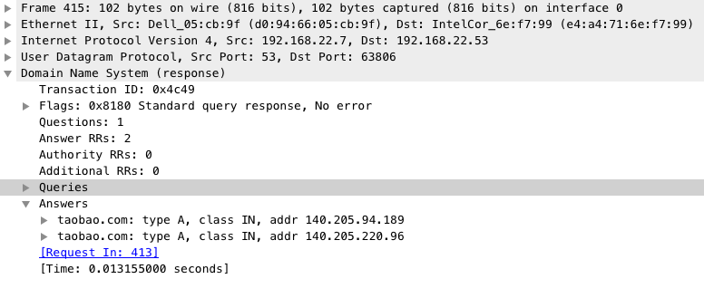

# DNS协议

之前提到当在浏览器中输入https://www.baidu.com时, 浏览器并不知道www.baidu.com的数据在哪个服务器上, 所以需要通过DNS服务器去找到www.baidu.com对应的IP地址

那为什么不直接记IP地址那, 为什么还有要用host来代替IP那?  
- 当然是IP地址没有host好记了
- 而且如果你公司牛逼了, 办公室升级了, 把服务器搬到别的地方去了, IP地址就变了, 这时候你还要让用户重新记一遍吗...

## DNS服务器

既然用户不会记住host对应的IP地址, 那肯定就会有人来帮着记, 这个人就是**DNS服务器**

当让不可能所有人都访问一个**DNS服务器**,所以它是**分布式的**

每个**DNS服务器**需要承载大量的请求, 并保证速度和稳定性, 所以它也要设置成**高可用和高并发**的

DNS服务器的树状的层次结构

根DNS服务器共有13套

## DNS解析

以下来说一下DNS解析的过程

* 当浏览器不知道www.taobao.com的IP地址时, 会发送DNS请求给本地的DNS服务器, 问它的IP地址是啥(别以为我用的是白话文, 人家就是这么问的, 不信看👇的图) ?   

    本地DNS服务器在你接入网络的时候就被运营商默认分配了, 你也可以去网络设置自定义修改, 通常大家修改为8.8.8.8或114.114.114.114   

    下图也可以看到DNS请求走的是UDP传输协议

* 当本地DNS服务器收到请求后, 会先查询服务器上的缓存列表, 查到就直接返回IP, 查不到就会发请求去根域名服务器. 根DNS服务器全球共有13套(不是13台机器, 而是13个IP地址, 全球有很多这些IP的镜像站点).

* 根DNS服务器收到请求, 发现后缀是.com, 就会让你去向 管理.com的顶级域名服务器去查询

* 本地DNS服务器再次发请求给顶级域名服务器, 他就会让你去taobao.com的权威域名服务器去查询

* 然后权威域名服务器再告诉本地DNS服务器, www.taobao.com的IP地址是XX.XX.XX.XX

* 最后由本地DNS服务器返回给浏览器上

下面放上完整的DNS解析过程图

## DNS负载均衡

之前问了DNS服务器除了查询IP地址还能做什么, 答案就是负载均衡了.

像百度, 淘宝这种大网站, 当然不可能只有一个服务器啦, 所以像www.baidu.com这个网站, 后面会有N个服务器放到全国各地, 所以当你请求www.baidu.com时, 直接去离你最近的一个服务器拿数据, 肯定是最快的了, 这就是负载均衡.

那负载均衡怎么做的那

- 之前的步骤不变, 当到了最后的权威DNS服务器的时候, 权威DNS服务器不返回IP地址, 而是将起了个别名CNAME, 然后让本地DNS服务器去 全局负载均衡器（GSLB，Global Server Load Balance)解析这个域名

- 本地DNS服务器再去GSLB去解析域名

- GSLB通过策略选出最优解返回, 这里根据配置的不同可能返回一个IP也可能返回多个

- 最后本地DNS再将IP地址返还给浏览器

看图中将www.baidu.com起了个CNAME为 www.a.shife.com(我也不知道为啥叫这个), 最后本地DNS服务器返回的是www.a.shife.com的两个IP地址为 182.61.200.6和182.61.200.7, 你可以通过ip138来查询这两个ip地址, 你会发现他们确实绑定了www.baidu.com的域名

至于为什么要起别名CNAME, 大家可以[点击看一下](https://blog.csdn.net/u010954257/article/details/54178146)