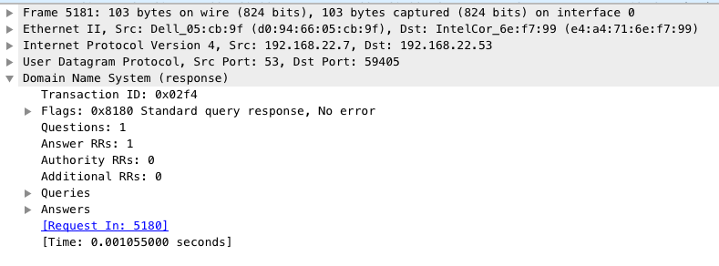
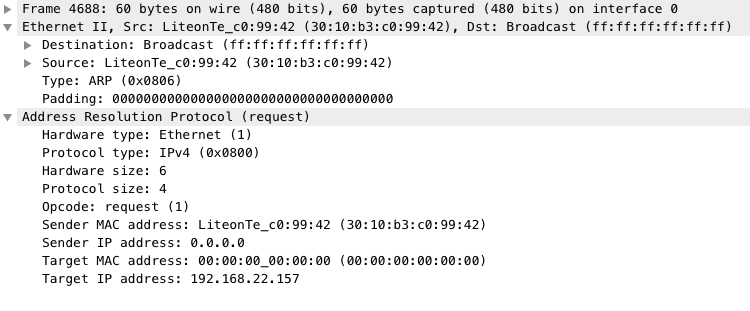
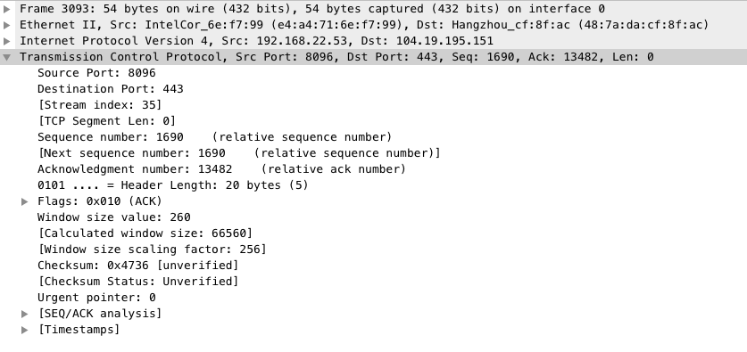
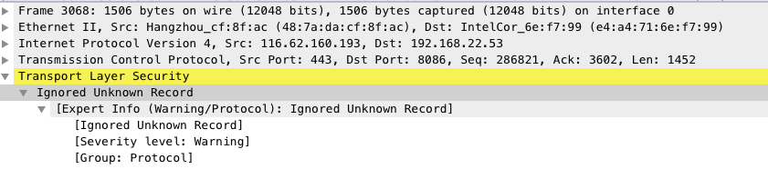
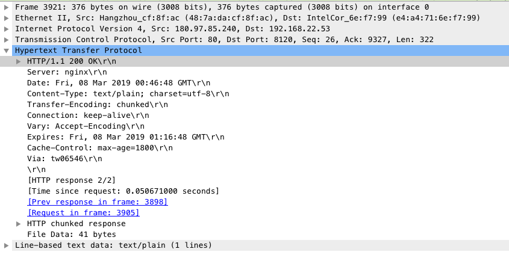
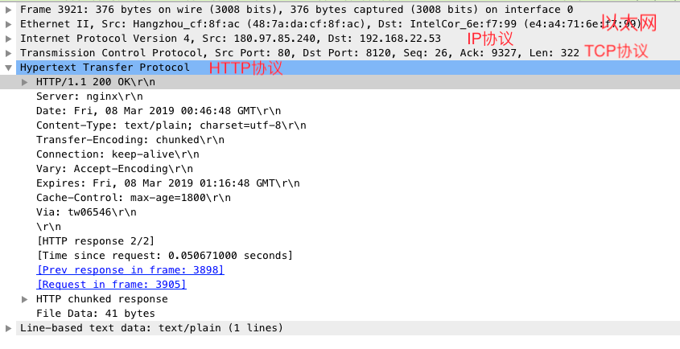

# 网路
- 本章节主要讲的是一个完整的HTTPS请求的一生
### HTTPS请求
当你在浏览器中输入**https://www.baidu.com**时,发生了那些事

- 浏览器不知道**www.baidu.com**在哪个服务器上,所以通过[DNS协议](https://github.com/NBBLIG/Hope/blob/master/%E7%BD%91%E7%BB%9C/DNS/README.md)获取了**www.baidu.com**对应的ip地址 **(Q: DNS除了查询IP地址还能做什么?)**

- 知道IP地址之后,还需要知道**MAC地址**才能建立链接,这时使用[ARP协议](https://github.com/NBBLIG/Hope/blob/master/%E7%BD%91%E7%BB%9C/%E4%BB%A5%E5%A4%AA%E7%BD%91/README.md)查找对应服务器的**MAC地址** 

- 这时通过[TCP/IP协议](https://github.com/NBBLIG/Hope/blob/master/%E7%BD%91%E7%BB%9C/TCP%3BIP/README.md) 三次握手建立链接

- TCP建立链接后, 由于是HTTPS请求, 还需要[SSL/TLS协议](https://github.com/NBBLIG/Hope/blob/master/%E7%BD%91%E7%BB%9C/TLS%3BSSL/README.md)四次握手建立链接

- 上面都通过后, 最后使用[HTTP协议](https://github.com/NBBLIG/Hope/blob/master/%E7%BD%91%E7%BB%9C/HTTP/README.md), 在建立好的通道中传输数据

以上就是一个简洁版的HTTPS请求建立链接的过程
每个过程👇的配图是通过[Wireshark](https://www.wireshark.org/download.html)截获的对应协议的数据包, 从中可以看到每个协议的数据包发送出来都经过了哪些协议的封装, 例如: 👇这个HTTP数据包

从图中可以看到, 要解析这个数据包先要经过 以太网 -> IP -> TCP -> HTTP **(Q: 通过看图,你能知道DNS协议是用的什么传输协议吗?)**
可以自行下载[Wireshark](https://www.wireshark.org/download.html)来查看具体协议里面的详情,也可以等我之后慢慢写. 