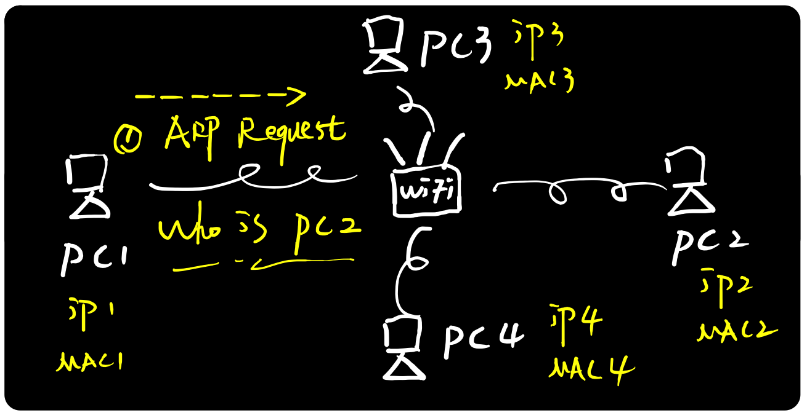
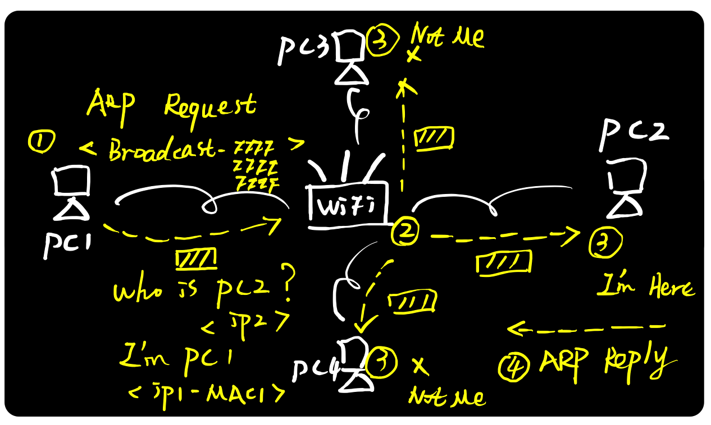
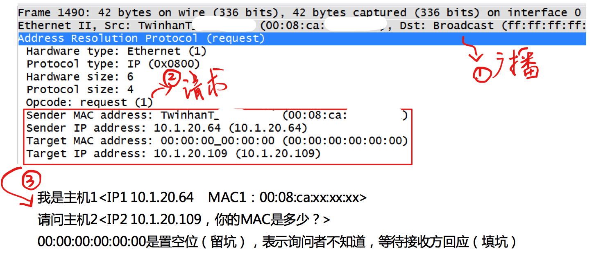
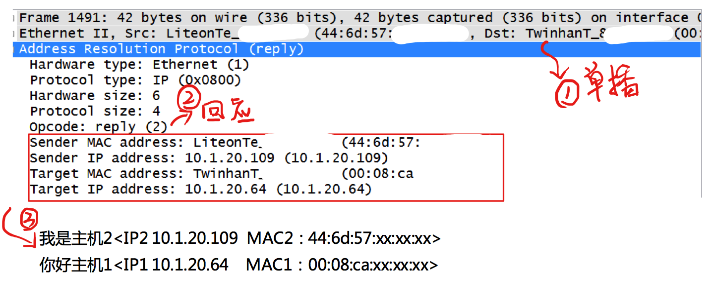

# 数据链路层

在网络通信中，主机和主机通信的数据包需要依据OSI模型从上到下进行数据封装，当数据封装完整后，再向外发出。所以在局域网的通信中，不仅需要源目IP地址的封装，也需要源目MAC的封装。

通过Wireshark抓包你可以看到，不论是DNS请求、TCP、UDP还是http请求的数据包，都会带上一个MAC头，MAC头中包含了目标MAC地址和源MAC地址，MAC地址是唯一的，每个网卡都对应着一个MAC地址。（现在由于虚拟机的出现，MAC地址也不一定是唯一的了，不过只要保证在局域网内MAC地址是唯一的就不会出问题）

一般情况下，上层应用程序更多关心IP地址而不关心MAC地址，所以需要通过ARP协议来获知目的主机的MAC地址，完成数据封装。

## ARP协议

**ARP（Address Resolution Protocol）即地址解析协议**， 用于实现从 IP 地址到 MAC 地址的映射，即询问目标IP对应的MAC地址。

大家应该都有过在寝室局域网联机打魔兽的经历, 那当时两个电脑是如何通讯的那?

假如你的电脑室pc1, 要与你通讯的电脑是pc2, 如下图

pc1在局域网中发送ARP广播包, 问 who is pc2, 在局域网中的所有电脑都会收到这条广播包.

这条广播包包含如下信息

- 源MAC地址: pc1自己的MAC地址
- 目标MAC地址: 由于不知道目标MAC地址, 发送的广播消息, 这里全是f (ffff.ffff.ffff)
- 源IP地址: pc1的IP地址
- 目标IP地址: pc2的IP地址

我们来看一下局域网中所有机器收到广播请求包的反应

可以看到, pc3和pc4拿到数据包后, 发现不是问自己的, 直接酱爆丢弃, 这个步骤用户是无感知的. **pc2收到后, 根据里面的IP信息, 发现是问自己的, 就会返回ARP回应包**

ARP的请求是通过广播发送的, 但回应包却不需要使用广播, **大部分网络协议在设计的时候，都需要保持极度克制，不需要的交互就砍掉，能合并的信息就合并，能不用广播就用单播，以此让带宽变得更多让网络变得更快。**

因为pc1发送ARP请求包的时候带上了自己的IP和MAC地址, 所以回应的时候, pc2是知道pc1的所有信息的, 直接返回ARP单播回应即可.

**[ARP请求包]**

**[ARP回应包]**

## 如何上网

我们上面已经说了局域网中如何通讯, 现在你们寝室的人不想打局域网的魔兽了, 想上网跟世界各地的人一起打.

你们寝室每个人的电脑都有自己在局域网中的IP地址, 然后统一链接到了路由器上, 路由器连接在外网上. **往往路由器就是一个网关, 是一个三层转发设备.**, 他会把数据包的MAC头和IP头都取下来, 然后根据内容, 在进行转发.

而**网关**又有不改变IP地址的**转发网关**, 和 改变IP地址的 **NAT网关**

我们主要说一下**NAT网关**

### NAT(Network Address Translation)网关

我们现在主要使用的就是NAT网关, 因为各个局域网之间没有商量, 各自定各自的IP, 所以经常会产生你在局域网中的IP地址使192.168.1.1, 而你要访问的服务器在局域网中的IP地址也是 192.168.1.1

所以要在公网上通讯, 就得用公网IP地址, 但公网IP太贵了, 不能一台电脑一个公网IP, 所以就会通过NAT网关来进行转换. 

当我们知道了服务器的IP地址, 想访问远程服务器时, 具体流程如下

- 首先电脑判断服务器IP与自己的并不在同一网段, 然后把数据包发送给网关, 网关IP地址已经提前配置好, 我们只需发送ARP请求, 获取网关的MAC地址, 然后发送.

- 网关收到数据包后, 解析MAC头, 发现是自己的MAC地址. 将包收入, 然后转发

- 网关先将内网IP地址转为公网IP地址, 然后根据路由表等配置规则, 找到目标服务器的网关, 然后发送ARP请求, 获取目标服务器网关的MAC地址, 进行数据发送(中间可能经过多个网关)

- 目标服务器网关收到数据后, 将公网IP转为内网IP, 然后发送ARP请求, 获取服务器的MAC地址, 然后将数据发送给服务器

- 服务器处理完数据后, 数据原路返回

以上大概就是一个网络请求的过程

## ARP协议是属于数据链路层还是网络层?

**协议到底所属哪一层，可以从应用/功能来考虑，也可以从层次/包封装来考虑。**

以ARP协议为例，它的功能最终是获取到MAC信息，服务于链路层，从这点考虑，ARP是链路层协议；但是从层次来看，ARP基于Ethernet协议，IP协议基于Ethernet协议，它们在Ethernet协议里面有独立的Type类型，前者是0x0806，后者是0x0800，既然ARP和IP协议"平起平坐"，那么IP是网络层，ARP难道就不是网络层？